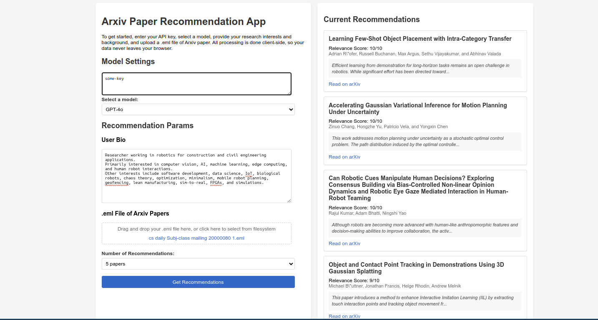
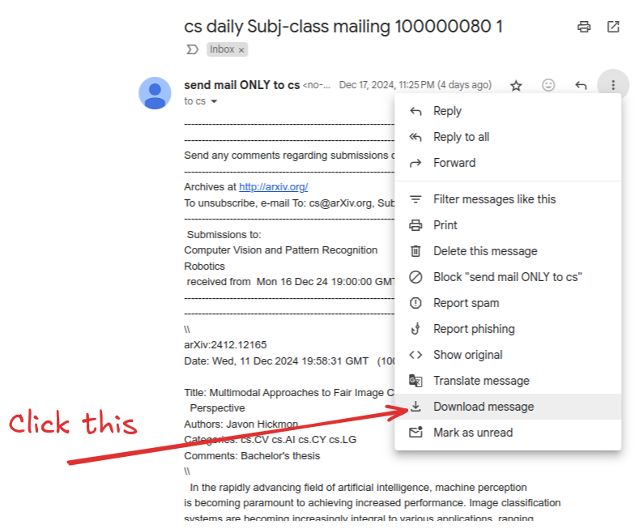

# arXiv Daily Paper Recommender
An AI-powered web application that recommends relevant arXiv papers based on your research interests. It processes your daily arXiv email subscriptions and generates a personalized list of the most relevant papers using an AI ranking system.

<p align="center">
  
</p>

## Features
- Web-based interface for easy paper recommendations
- Upload and process arXiv email subscription content (.eml files)
- Customize number of recommendations (1-5 papers)
- Enter research interests directly through the UI
- Real-time paper ranking based on your research profile
- Interactive paper cards with titles, authors, and abstracts
- Direct links to full papers on arXiv
- Containerized for easy deployment

## Prerequisites
- Docker and Docker Compose
- OpenAI API key

## Setup
1. Clone the repository:
```bash
git clone https://github.com/jc-cr/arXiv-daily-paper-recommender.git
cd arXiv-daily-paper-recommender
```

2. Create a `.env` file in the `.docker` directory with your OpenAI API key:
```bash
API_KEY=your_api_key_here
```

3. Build and start the application:
```bash
cd .docker
docker compose up --build
```

## Usage
1. Access the web interface at `http://localhost:5000`

2. Enter your research interests:
   - Use the text area to describe your research background, interests, and current projects
   - Be specific about your technical focus areas and expertise

3. Upload your arXiv email:
   - Download your arXiv subscription email as an .eml file from your email client
     (e.g., in Gmail: More -> Download message)
   - Drag and drop the .eml file into the upload area or click to select

4. Select preferences:
   - Choose the number of recommendations you want (1-5 papers)
   - Default is set to 5 papers

5. Get recommendations:
   - Click "Get Recommendations" to process your input
   - View recommended papers with titles, authors, abstracts, and direct arXiv links
   - Each paper is ranked by relevance to your research interests

### Example Research Profile
When entering your research interests, be specific about your focus areas. For example:

```
Researcher working in robotics for construction and civil engineering applications.
Primarily interested in computer vision, AI, machine learning, edge computing, and human robot interactions. 
Other interests include software development, data science, IoT, biological robots, chaos theory, optimization, minimalism, mobile robot planning, geofencing, lean manufacturing, sim-to-real, FPGAs, anime-to-real-life, and simulations.
```

### Getting The .eml File

Follow the instructions on ArXiv's website to subscribe to daily email alerts: [arXiv Email Alerts](https://arxiv.org/help/subscribe)

To download the .eml file on Gmail click the three dots on the email and select "Download message".
<p align="center">
  
</p>


## License
This project is licensed under the MIT License - see the LICENSE file for details.
